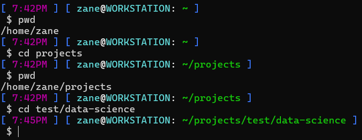
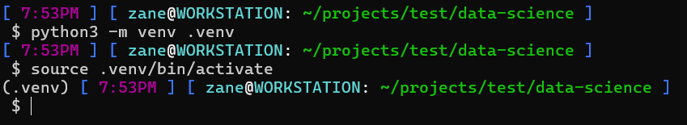
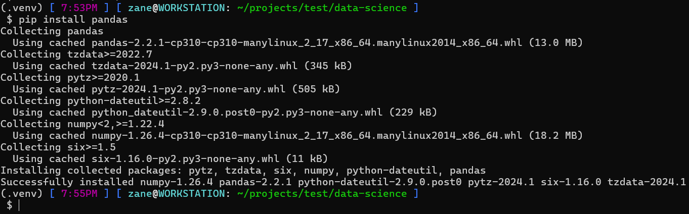
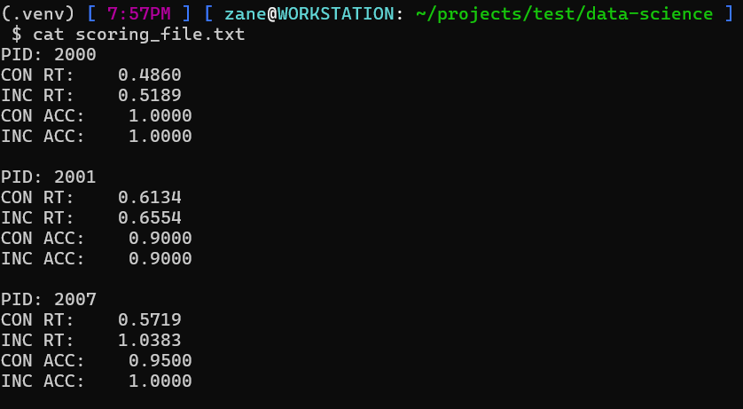

# CHARM FLANKER SCORING

## First time setup:
1. For the code to be able to run, your computer must have a Python interpreter (v3 or greater). Confirm this with ```python3 --version```
2. In a terminal window, navigate to the project directory (use 'cd {folder-name}').


- *Working directory is shown in green (~ is equivalent to /home/user)*
- *'pwd' will Print Working Directory, and was only used for demonstration*
---

3. Create an environment in order to install Pandas (framework we use to manipulate data):
```python3 -m venv .venv``` <-- '-m venv' sets 'mode' to 'venv' (virtual environment), and '.venv' is name of resulting folder
4. Put the environment that was just created into context: ```source .venv/bin/activate```


---

5. Install dependency using ```pip install pandas``` <-- pip is a Python package manager, and Pandas is a data manipulation framework for Python


---

6. Execute Python script with ```python3 score.py```
7. The outputted scores will be sent to 'scoring_file.txt' in the same directory. Use command 'cat' to display the contents of the file: ```cat scoring_file.txt``` (or view in Operating System specific text viewer)


---

8. To remove virtual environment from context, use command ```deactivate```

## For future runs:
1. Once you create the virtual environment and install Pandas to it, you can reuse this environment again the next time.
2. If you already have the environment configured, navigate to the same project directory and use the command again: ```source .venv/bin/activate```.
3. No need to install anything this time. You can execute the Python code that uses Pandas by using the command ```python3 score.py```.When done executing code that requires Pandas, use command ```deactivate``` (regular Python code can be executed without this virtual environment; when Pandas is required we can use the environment to keep our dependencies organized)